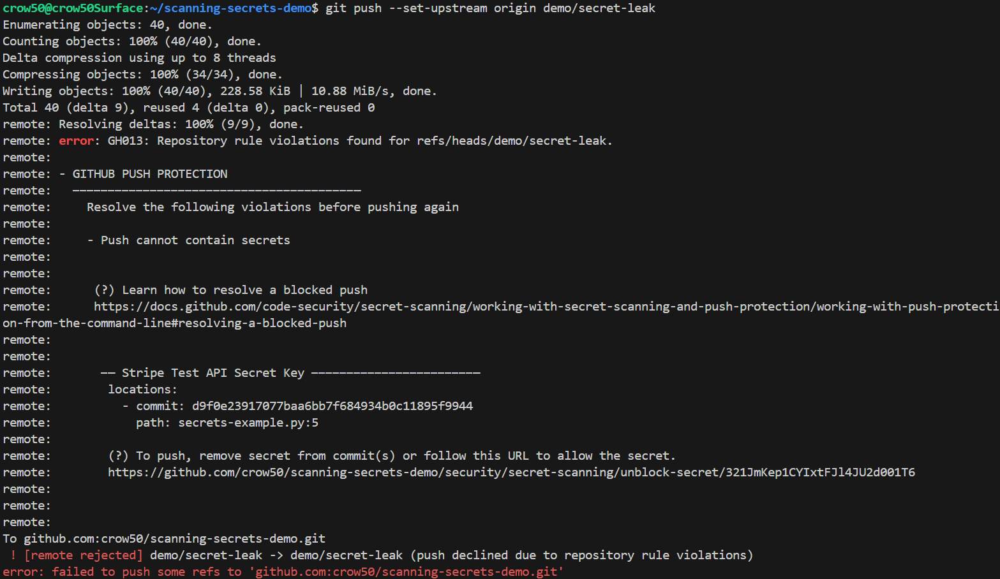
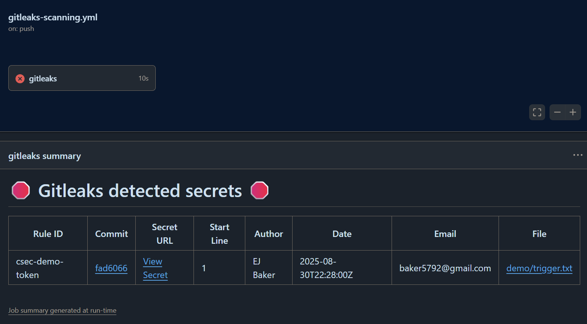
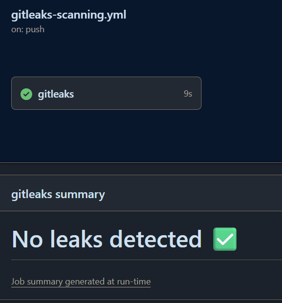
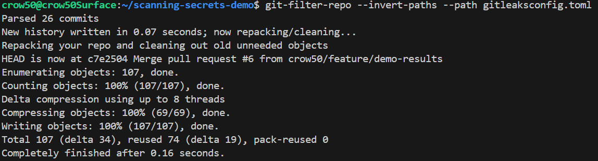
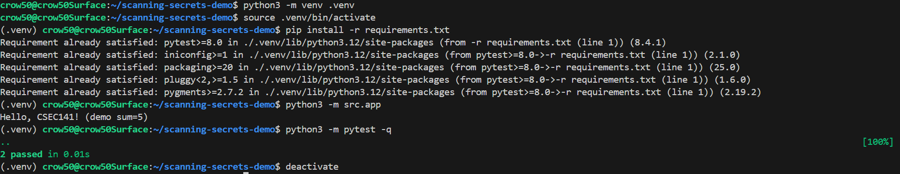
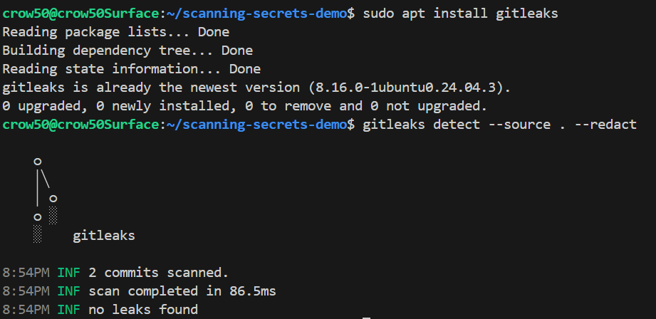
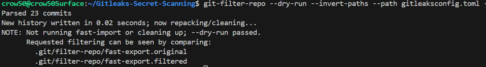

# Secrets in Git – Detection & Prevention Using Gitleaks

A practical demonstration of detecting and preventing committed secrets using both **GitHub Advanced Security** and **Gitleaks** in a CI/CD pipeline.
This project was developed as a 10-minute demo for **CSEC141 (Fall 2025)** and serves as a portfolio example for DevSecOps practices.

[](https://github.com/crow50/scanning-secrets-demo/actions/workflows/test.yml)

[](https://github.com/crow50/Gitleaks-Secret-Scanning/actions/workflows/gitleaks-scanning.yml)


---

## Why Secrets Scanning Matters

Accidentally committing secrets like API keys or passwords to a public repository can expose sensitive systems to attackers. Even brief exposure can lead to:

* Unauthorized access to cloud resources
* Data breaches or service disruptions
* Costly incident response and key rotation efforts

---

## What Counts as a Secret?

A "secret" can be any sensitive value not intended for the public:

* API keys (AWS, Azure, GCP)
* Database connection strings
* Access tokens or SSH keys
* User credentials or OAuth secrets

---

## GitHub Advanced Security

* **Built-in Secret Scanning:**
  All public repositories automatically have GitHub's native secret scanning enabled. It alerts repo owners when known secret patterns, such as AWS Keys, are pushed.

* **Push Protection:**
  Blocks commits containing *supported* secret types before they leave the local environment.

* **Limitations:**

  * Only covers predefined secret patterns
  * No custom rule support
  * Alerts after-the-fact unless Push Protection is enabled

---

## Gitleaks Integration in CI/CD

[Gitleaks](https://github.com/gitleaks/gitleaks) is an open-source secrets scanning tool. In this demo, it is integrated into a GitHub Actions workflow to:

1. Scan commits and pull requests for **known** and **custom** patterns
2. Fail the CI pipeline if secrets are detected
3. Provide auditable logs for security reviews

Key advantages:

* Supports **custom regex rules** for org-specific secrets
* Detects **high-entropy strings** likely to be secrets
* Works on **local hooks** (pre-commit) and CI pipelines

Check out the playground on their [main site](https://gitleaks.io/) and test your configs.

---

## Git-Filter-Repo

[Git-Filter-Repo](https://github.com/newren/git-filter-repo) is a powerful git history rewriting tool that replaces `git filter-branch` with a faster, and more flexible alternative. Ideal for removing committed secrets, large files, or sensitive metadata from a repository's history.

* Use cases
  * remove secrets, strip large blobs, rewrite author details, split/merge repos.
* Caution: rewriting history changes commit hashes — coordinate with collaborators and force-push carefully.


Example: remove a file named `gitleaksconfig.toml` from all commits:
  `git-filter-repo --invert-paths --paths gitleaksconfig.toml`

---

## Project Structure

```
Gitleaks-Secret-Scanning/
|- .github/workflows/
|-- test.yml
|-- gitleaks-scanning.yml
|- src/
|-- __init__.py
|-- app.py
|-- utils.py
|- tests/test_app.py
|- .gitignore
|- gitleaksconfig.toml
|- LICENSE
|- README.md
|- requirements.txt
```

---

## Demo Workflow

1. **Native Protection** - Show GitHub blocking a known secret pattern via Push Protection.

2. **CI/CD Enforcement** - Push code containing a fake secret -> Gitleaks scans -> pipeline fails.

3. **Remediation** - Remove the secret, push clean code -> pipeline passes.

4. **Git Filter Repo Remediation** - Remove the secret file from the repo commits history -> new repo with same pipelines


---

## Local Development

To run demo files:

```bash
# Activate Python venv
python3 -m venv .venv
source .venv/bin/activate

# Install requirements
pip install -r requirements.txt

# Run the app
python3 -m src.app

# Run tests
python3 -m pytest -q
```


To run Gitleaks locally (Optional):

```bash
# Install gitleaks
brew install gitleaks   # Mac
choco install gitleaks  # Windows
sudo apt install gitleaks # Linux

# Run scan
gitleaks detect # --source . # set source string default $PWD # --no-git # to scan current repo dir # --redact # to redact secrets from logs and stdout
```


Purging leaked secrets:

```bash
brew install gitleaks   # Mac
choco install gitleaks  # Windows
sudo apt install gitleaks # Linux

# Analyze
mkdir -p .git/filter-repo
git-filter-repo --analyze # Outputs files to .git/filter-repo/analysis/

# Dry-run
git-filter-repo --dry-run --invert-paths --path # Outputs files to .git/filter-repo/

# Run Filter
git-filter-repo --invert-paths --path # Invert only affects files in --path string

# Force update current repository
git push --force --mirror origin

```


---

## License

This project is licensed under the MIT License.

---
